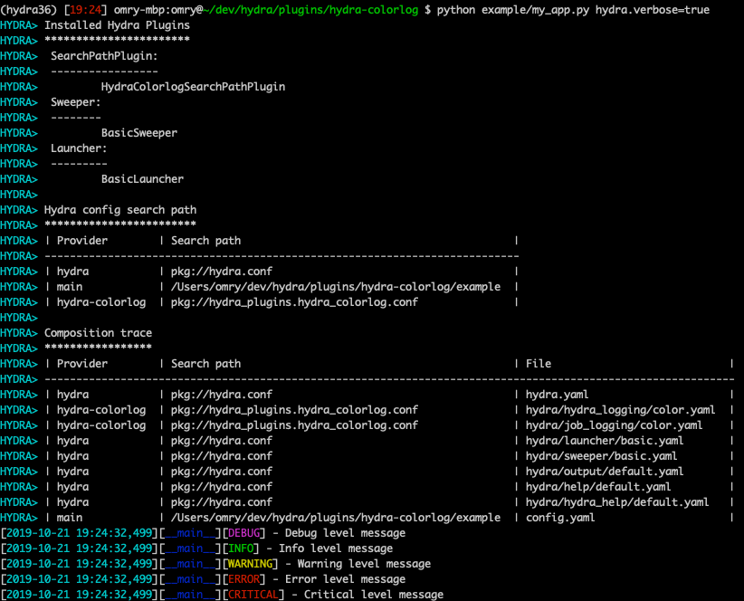

# Hydra colorlog
Adds a colorlog for hydra/job_logging and hydra/hydra_logging

See included [example](example).
Run the example with `python example/my_app.py hydra.verbose=true`.

Expected output:

