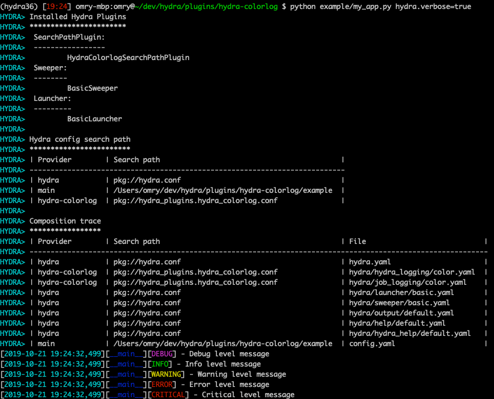

Adds a colorlog for hydra/job_logging and hydra/hydra_logging.

Install with `pip install hydra_colorlog`.

Once installed, override `hydra/job_logging` and `hydra/hydra_logging` your config:

```yaml
defaults:
  - hydra/job_logging: color
  - hydra/hydra_logging: color
```

See included [example](example).
 
